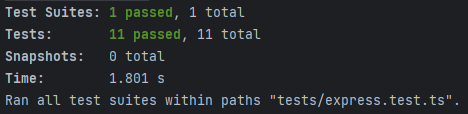

# dotCards REST API Challenge

### Author: Spencer Carlson

This project uses Express and [Sequelize](https://www.npmjs.com/package//sequelize) to create a functional REST API 
that performs CRUD operations on a MySQL database.

## Features
### Technical requirements met
- GET (/:collection/:id) requests fetch the specified row, returning JSON to the client.
- POST (/:collection) requests create a new row in the database if the correct parameters are specified.
- POST (/:collection/:id) requests modify a row in the database if the specified ID exists.
- DELETE (/:collection/:id) requests remove a row from the database if the specified ID exists.
- On server startup, tables specified in `schema.ts` are created in the database.
---
### Project details
- Project is fully Dockerized: docker-compose.yml spins up fresh MySQL and NodeJS servers.
- 11 unit tests check edge cases like malformed parameters, invalid table names, and IDs.
- Proper error handling for unexpected events, detailed error messages are sent back to the client.
- Code is well-documented, concise and organized.

If this project were running in a concurrent environment, we would need to verify that data being modified isn't already 
being modified elsewhere. This can be achieved using transactions and proper table/row locking when necessary.

Overall, I really enjoyed this project. It was a lot of fun, and it taught me about health check commands in Docker.

## Running the project

To run the project, drop in to this directory from the command line and run:

`docker compose up`

This will run a MySQL server, and the test suite located in the `tests/` directory.

## Screenshots

